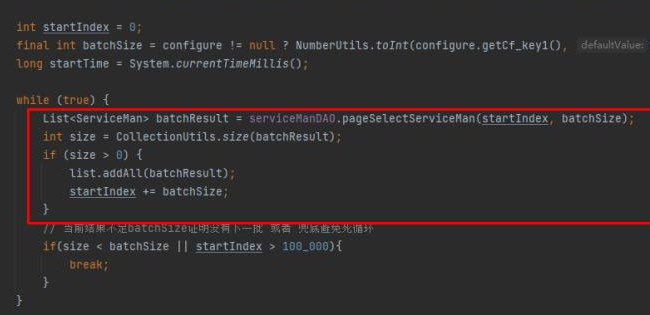
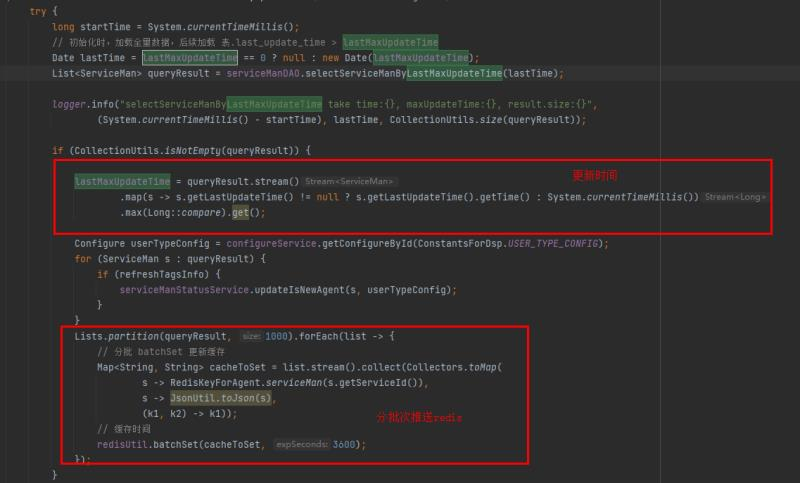

## 慢查询具体例子


### 精简 sql，去除一些冗余操作
1. 问题：重复去重，distinct 和 union 都有去重的操作
   可以不使用 union，可以把where条件进行整合成一个简单查询
```sql
-- user_account 和 token_mobile 都有索引
select distinct user_account from (

select user_account from user where token!='0' and user_account!='param_1' and able_flag=1

union

select user_account from user where token_mobile!='0' and user_account!='param_1' and able_flag=1 )  t
```
解决办法：
方案一：

```sql
SELECT distinct user_account FROM user WHERE (token != '0' or token_mobile != '0') AND user_account != 'param_1' AND able_flag = 1

```
方案二：有重复去重操作，去掉distinct，union 已经去重

方案三：重复去重操作 union 改为 union all，由distinct 去重

因为查询数据集很小，优化后性能并没有明显提升

2. 问题：其实这个就是为了得到最大的 cid 
```sql
select cid
from chat_history
where status=2
and userid=3432423
and (vendoraccount='param_1' or queue_code in ('vd','8'))

order by cid desc limit 1
```
解决：
1. 去掉order by cid desc limit 1
2. select cid 改为
   select max(cid)

优化后减少了 filesort


### 业务方面调整查询条件(减少查询范围，去除非必要字段)
1. 场景描述: 某业务需要加载用户列表，用户列表又涉及到字段的更新，需要定时刷新
   现有解决方案：项目本地使用spring schedule定时任务每隔一段时间去数据库请求数据缓存到本地，因为数据量可能过多，所以分批次加载，每次加载都是全量加载。   
   问题:
   1. 因为项目是多实例部署的，导致所有的实例都在跑定时任务，即使没有用到数据的实例
   2. 每次加载都是全量，没有更新的数据也重新加载了一次
   3. 加载的数据缓存在本地，需要维护多个数据

    
    解决方案：   
    1. 从spring schedule迁移到job task(saturn console)
    2. 初始化全量加载一次，并记录这批数据的最大更新时间，记为lastMaxUpdateTime job定时按 数据表中的更新字段 > lastMaxUpdateTime加载增量更新的数据列表
    3. 缓存从本地缓存改为 redis 缓存
    

2. 查询范围大
```sql
select cid,finishtime,vendoraccount from chat_history where status=2 and cih_finishtime>date_sub(current_timestamp(),interval 7200 second)  and cih_finishtime < date_sub(current_timestamp(),interval 600 second) limit 0,1000
```
解决：cih_finishtime 时间范围减少 （两小时->半小时）


### 当多表连接时，在不影响索引的使用下，可以用将where过滤条件、limit、group by 等操作先查询过滤一遍驱动表，得到小的数据集再进行连接，虽然会多一次查询，但是当驱动表的数据非常大时，会有显著的性能提升
1. 问题：group by 和 order by 无法利用索引，效率低
```sql
select
count(1),
service_id,
user.group_id, user.default_groupid, user.status
from
chatinfohead left join user user
on chatinfohead.service_id = user.user_account_num
where
(chatinfohead.vendoraccount = 'param_1' or chatinfohead.queue_code = '8') and chatinfohead.service_id != '' and chatinfohead.status = '1' and chatinfohead.queue_code != '5'
group by chatinfohead.service_id
order by chatnum
```
解决：1.实际上关联 user 只是为了取 几个字段，因为 user_account_num 字段是唯一性的，左表一条数据最多对应右表一条数据，连表不会影响group by 和 order by 的操作，所以可以将 groupby 和orderby 的操作先在 驱动表 执行完滤过成一个小的数据集合，再去关联取 user 表的字段

减少了关联的数据量，时间减半

2. 问题：conn_data 是驱动表，数据量大，连接表耗时
   连接表 并不会影响 groupby操作，（user_account_num是唯一取值）
```sql
SELECT
usernum,
user_name username,
user_name_encrypt usernameencrypt,
...
sum(
two_count)newevalusertiontwocount, sum(
three_count)newevalusertionthreecount, sum(
four_count)newevalusertionfourcount, sum(
five_count)newevalusertionfivecount
FROM
conn_data, user
WHERE caldate BETWEEN '2021-12-26 00:00:00' and '2021-12-28 23:59:59' 
AND usernum = user_account_num
GROUP BY usernum , user_name , user_default_group_name
```
解决:1.先将 groupby 在驱动表完成，降低数据量再进行连接

2.去掉groupby user_name user_default_group , usernum 的取值是唯一的，usernum 后的字段

生产测试 从 5.x - > 3.x

3. 问题：表连接只是为了取少量字段
   连接生成表数据量大，再进行 limit
```sql
SELECT 
    r.id,
    r.clientid,
  ...
    r.ignore_response,
    r.copywriting,
    CASE
        WHEN r.msg_token = '' THEN r.id
        ELSE r.msg_token
    END msgid,
    r.status AS msgstatus,
    d.msg_new msgnew,
    d.msg_verison msgversion,
    d.msg_origin msgorigin
FROM
    robot_msg_detail r
        JOIN
    robot_msg_detail_fmt d ON r.id = d.msg_id
WHERE
    r.clientid = '282548559'
        AND r.sendtime >= '2021-10-08 15:53:47'
        AND r.sendtime < '2022-01-06 15:53:46'
        AND r.vendorcode = '603410'
        AND r.brandstoresn = '10004114'
ORDER BY r.sendtime DESC , r.flag DESC , r.id DESC
LIMIT 0 , 30
```
解决：1.robot_msg_detail 查出的数据在 500 - 10000，只要求拿出30条，先在 robot_msg_detail 过滤条件再进行连接

测试数据 1000行，从 500 → 15

### 拆分 sql 耗时操作分别执行，或者将 耗时 操作转移到程序完成
1. 问题：使用了 chatid 索引，但排序是用 sendtime, 导致使用file sort
```sql
select
  cd_id, chatid, sendername
  receivername, msg, date_format(sendtime, '%y-%m-%d %h:%i:%s') sendtime
from
  chatinfo_detail
where
  chatid = '45345'
order by
  sendtime,
  flag
```
解决：1.把sql的order by删除

在应用里做sort

减少了 filesort

2. 问题：chatinfo_detail 是大表，表连接很耗时
   user的作用取 user_name 做判断
   返回的数据数量少，在 100 行以下
```sql
select
cd_id, chatid,
case when u.user_name is not null then u.user_name else sendername end as sendername,flag,type,status
from
chatinfo_detail cd left join user u
on cd.sendername = u.user_account_num where chatid = 4535435
order by cd.cd_id asc
```

解决：
1. 将连接操作拆分为两个sql执行   
2. 根据chatid 在chatinfo_detail查出数据   
根据步骤1查出的数据,去重找出sendername   
拿2的sendername在user表查出user_name   
在应用里做sendername的加工  