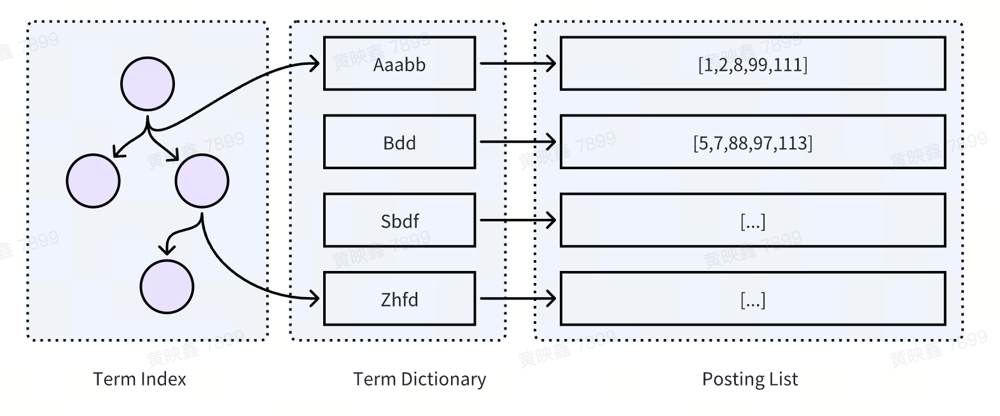

# ES

## doc_id和_id
### doc_id
底层引擎标识文档唯一性。
* 内部使用：lucene底层生成的文档唯一标识符，倒排索引存储的是doc_id，内部使用。
* 非永久性：索引重建、段合并等操作会改变，不适合做文档标识存储。

### _id
es标识文档唯一性，在lucene底层作为普通字段存储，默认不会设置doc values。
* 自定义：用户指定或者es自动生成，es默认使用该字段做路由，对外透出。
* 永久使用：写入后不会改变，可以作为文档标识存储。

## 查询顺序
没有固定顺序，es会根据每个子句涉及的文档数、数据重复率等来优先处理成本小的。
[In which order are my Elasticsearch queries/filters executed?](https://www.elastic.co/cn/blog/elasticsearch-query-execution-order)

## 查询上下文和过滤上下文
### 查询上下文
检查文档是否符合条件+计算相关性得分，通常用于全文搜索，主要关心的是文档的匹配程度。query是查询上下文。

### 过滤上下文
检查文档是否符合条件，不会计算相关性得分，通常用于范围、等值查询等。filter是过滤上下文，频繁调用的filter结果会被缓存用于提升速度。

## 不同版本重要特性
### 6.0
1. 稀疏Doc Values
es使用列式存储，在数据排序、聚合性能好，稀疏Doc values对文档没有某个字段情况进行优化，减少存储这种情况带来的开销。
```es
PUT /my_index
{
  "mappings": {
    "properties": {
      "my_field": {
        "type": "keyword",
        "doc_values": false
      }
    }
  }
}
```


2. index sorting
在索引数据时进行排序，适合经常需要做排序、聚合操作的字段，写入有额外开销。
```es
PUT /my_index
{
  "settings": {
    "index": {
      "sort.field": ["price", "date"],  // 指定排序字段
      "sort.order": ["asc", "desc"]     // 指定每个字段的排序顺序
    }
  },
  "mappings": {
    "properties": {
      "price": {
        "type": "double"
      },
      "date": {
        "type": "date"
      }
    }
  }
}
```
[Index Sorting in Lucene](https://www.elastic.co/cn/blog/index-sorting-elasticsearch-6-0)

3. 不支持一个index中多个type
type被类比为数据库模型中的表，但是同index中不同type底层不是独立存储，es会把不同type的字段合并存储，就会造成以下影响：
* 字段爆炸，每个文档随着type增多而增多，造成字段稀疏问题
* 小type和大type之间查询和写入相互影响
* 不同type相同名称类型必须相同

4. 基于负载均衡
从轮训匀请求路由，改为基于机器负载路由，会考虑机器cpu、内存、磁盘等情况。

### 7.0
1. 去除type
2. 配置默认值修改
* 默认分片数 5->1

3. 引入Zen 2集群协调机制
减少处理网络分区和节点故障带来"脑裂"问题。
* 选举主节点和主节点发布更改(增删节点)都需要其他节点半数以上确认
* 优化故障检测机制和支持管理员灵活的故障配置

4. 安全特性免费使用
5. Lucene 9.0
6. 内存断路器
通过监控内存使用情况，并在达到某个阈值时阻断进一步的操作，从而保护节点稳定性。

7. Weak-AND算法思想
Weak-AND 算法是在传统的 AND 和 OR 查询操作之间提供了一种折中的方法。在标准的 AND 查询中，只有包含所有查询词的文档才会被检索出来。而在 OR 查询中，包含任何一个查询词的文档都会被检索。算法通过设置一个阈值来工作，这个阈值决定了一个文档必须包含多少查询词才能被认为是相关的。
```es
GET /_search
{
  "query": {
    "bool": {
      "should": [
        { "match": { "field1": "keyword1" }},
        { "match": { "field2": "keyword2" }},
        { "match": { "field3": "keyword3" }},
        { "match": { "field4": "keyword4" }}
      ],
      "minimum_should_match": 3  // 至少需要匹配的条件数
    }
  }
}
```

8. 间隔查询
适用于需要精确控制词项之间距离和顺序的全文搜索场景，如法律文档、学术文章或任何结构化文本的复杂文本分析。
```es
// 找到包含“Elasticsearch”后面紧跟“search”（中间最多有三个其他词）的文档,any_of 来指定任何一个条件满足即可，或使用 not_containing 来排除某些词的出现
GET /books/_search
{
  "query": {
    "intervals" : {
      "content" : {
        "all_of" : {
          "intervals" : [
            {
              "match" : {
                "query" : "Elasticsearch",
                "max_gaps" : 0, -- 指定词项之间允许的最大间隔数
                "ordered" : true  -- 指定词项是否需要按照给定的顺序出现
              }
            },
            {
              "match" : {
                "query" : "search",
                "max_gaps" : 3,
                "ordered" : true
              }
            }
          ]
        }
      }
    }
  }
}
```


## 容量评估
### 分片数
容量建议10-20G

### 总存储
磁盘大小 = （数据量 * 副本数）/ 预计的利用率
30G数据，打算存储4主1备，磁盘利用率按50%算，那么需要申请的总存储空间为 30G * 8 / 50% = 480G

### 内存大小
总内存大小  = （数据量 * 副本数） / N(离线场景 N=20； 高性能在线场景 N=2) 
* 性能要求不高：480G/20=24G
* 要求高：480G/2=240G

### 实例个数
* 写速度
单机最高50MB/s写入，实例数=每秒写入pqs * 一条数据大小 * 分片数 / 单机最高写入

* 内存
单节点内存上限128G，实例数=总内存/单节点内存

* 存储
单节点存储最高30T

### 实例规格
* 内存=总内存/节点数(cpu:mem=1:2/1:4)
* 存储规格=总存储/节点数

## 集群
* 主从架构

### 节点
集群由多个Node节点组成，一个Node节点有多个Shard分片，一个Shard分片就是一个Lucene 实例
#### 节点类型
* Master Node 主节点
控制整个集群的元数据。只有Master Node节点可以修改节点状态信息及元数据(metadata)的处理，比如索引的新增、删除、分片路由分配、所有索引和相关 Mapping 、Setting 配置等等。

* Master Eligible Node 合格节点
Master节点的备份，该节点只是与集群保持心跳，判断Master是否存活，如果Master故障则参加新一轮的Master选举。

* Data Node 数据节点
存储数据的节点

* Coordinating Node 协调节点
协调客户端请求，路由到对应数据节点上，查询数据返回，并做数据的排序、过滤、合并，最后返回给客户端。

### Shard和Replic
* 分片，数据水平扩展能力
* 副本，容灾
* 一个主分片上只会有一个相同的doc
* Shard和Replic不会在同Node上
* Shard被确定后无法改变，Replic可以

## 路由
路由决定了一个文档会被存储到哪个 Shard 上：
shard = hash(routing) % number_of_primary_shards
routing 默认为文档的 _id

## 运营
### disk使用率
* 大于85%，无法进行索引创建/shard移动
* 大于95%，只度不写

## 重建索引
### reindex
异步查询数据复制到新索引，无法跟踪过程中修改的数据，需要听写。

### 理想方案
提供像binlog一样机制，复制数据发送mq，并监听变更，写入新索引，当新老索引数据差达到设置阈值，通过别名切换。如果有部分更新，切换前可以做短暂停写，mq数据消费完成后再切。


## 底层数据结构
### Block K-D Tree
* BKD树是用来搜索多维数据的一种树，在es中用于优化数字类型单维数据的范围查询。对于单维度的数据，实际上就是简单的对所有值做一个排序，然后反复从中间做切分，生成一个类似于B-tree这样的结构。和传统的B-tree不同的是，他的叶子结点存储的不是单值，而是一组值的集合，也就是是所谓的一个Block。每个Block内部包含的值数量控制在512- 1024个，保证值的数量在block之间尽量均匀分布。
* Lucene将这颗B-tree的非叶子结点部分放在内存里，而叶子结点紧紧相邻存放在磁盘上。当作range查询的时候，内存里的B-tree可以帮助快速定位到满足查询条件的叶子结点块在磁盘上的位置，之后对叶子结点块的读取几乎都是顺序的。

### 倒排索引
* 保存包含关键字的doc id list，关键字->posting list，适合做全文索引、匹配查询。
* posting list使用Delta Encoding(增量编码)算法压缩，

### Doc Values
列式存储，es中会把字段的值按docid的顺序存储。
* 用于快速检索单个字段值操作，例如聚合、排序等。
* 因为是按docid顺序存储，可以快速查询某个docid的字段值，用于查询时合并docid list时使用。
* text类型没有doc values

### Term Dictionary
为了能快速找到某个term，将所有的term按照字典序排序，还用"跳表"结构按一定的间隔来记录词项，用来加速词项信息的查找。在页里面实现二分查找。

### Term Index(字典树)
term太多，term dictionary也会很大，使用前缀字典数索引term dictionary，再使用FST压缩Term Index，可以将Term Index缓存到内存中。查询时先通过
Term Index找到对应Term Dictionary的Block，再去磁盘到找对应term，减少磁盘的随机读写。

### bitset
用于合并docid时使用，docid个数低于4096时使用数组，高于4096使用bitset。


## Q&A
### text和keyword的区别
* text全文索引，在写入时会被分析、转化，存储时不是原来文本，使用用于模糊匹配
* keyword不会被拆解，适合用于过滤、排序、聚合操作

### nested/object/join
1. object  
es中任意字段可以看作object类型，object被用于处理object对象/数组，会把对象扁平化，例如 {"user":{"first":"huang","name":"1"}} 打平为 user.first:"huang" 和 user.name:"1"，如果是数字，打平为数组，user.first:["huang","chen"] 和 user.name:["1","2"]。
* 对象之间的字段会被打平成为索引的字段，查询和正常字段一样
* 问题是会散失对象字段之间相关性

2. nested
lucene引擎没有nested的类型，只能处理扁平化文档。nested类型是es的封装实现，父子文档是共同存储在一个段中，保留结构字段的相关性。
* 查询需要嵌套在nested中
```es
{
  "query": {
    "nested": {
      "path": "user",
      "query": {
        "match": {"user.first" : "John"}
      }
    }
  }
}
```
* 可用于存放动态kv
  
3. join
建立不同文档之间父子关系，父子文档是独立存储，父子文档需要在同一分片。
* 父子文档独立写入，互不影响

4. 对比
* join父子文档独立存储，写入性能高，nested有写放大问题，需要整个父子文档覆盖更新
* nested父子文档共同存储，读取性能高
* 写入频繁用join，查询频繁用nested
[Elasticsearch Nested 选型，先看这一篇！](https://jishu.proginn.com/doc/4698647671c9aea6c)

### realtime
get、mget请求的参数，标志是否搜索实时数据，true会搜索事务日志中还没有刷盘的数据，返回最新版本，会有性能开销；false不会搜索日志，返回的不是实时数据。
