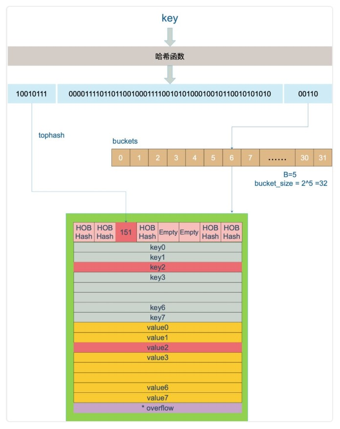

## Map


#### 底层数据结构

```go
type hmap struct {
 // 数据个数
 count     int // # live cells == size of map.  Must be first (used by len() builtin)
 flags     uint8
 B         uint8  // log_2 桶的数量 = 2^B
 noverflow uint16 // 溢出的桶的近似数
 hash0     uint32 // hash seed

 buckets    unsafe.Pointer // 底层数据数组指针  指向bmap[]
 oldbuckets unsafe.Pointer // 旧的数组指针 扩容时才不为nil
 nevacuate  uintptr        // progress counter for evacuation (buckets less than this have been evacuated)

 extra *mapextra // optional fields
}

//只有在map被标记为不包含指针才会使用该结构
type mapextra struct {
 overflow    *[]*bmap    //溢出指针
 oldoverflow *[]*bmap
 nextOverflow *bmap
}

//源码中只包含一个字段，实际编码完成后会增加更多属性
type bmap struct {
 tophash [bucketCnt]uint8
}

type bmap struct {
   topbits  [8]uint8         //key hash高8位的值，通过比较该值判断是否存在key
   keys     [8]keytype         //key和value分开存放
   values   [8]valuetype
   pad      uintptr
   overflow uintptr         //每个桶只能存放8个数据，超出新建新的桶，该字段指向溢出的桶
}

```

* 当key和value都不包含指针且key和value的大小都小于128字节，会将该map标记为不含指针，在gc回收时不需要扫描整个map(不包含指针，不需要继续向下标记)，因为bmap结构中包含由overflow溢出指针，所以将该字段转移到mapextra结构中存放。
* key和value是分开存放的，以key1/key2/.../value1/value2...的形式，好处是可以减少内存的补偿padding，节省内存空间，例如，有这样一个类型的 map：map[int64]int8 ，如果按照 key/value/key/value/... 这样的模式存储，那在每一个 key/value 对之后都要额外 padding 7 个字节；而将所有的 key，value 分别绑定到一起，这种形式 key/key/.../value/value/...，则只需要在最后添加 padding。
* topbits用于存放key的hash的前8位值

* tophash的特殊值

```go
// 空的 cell，也是初始时 bucket 的状态
empty          = 0
// 空的 cell，表示 cell 已经被迁移到新的 bucket
evacuatedEmpty = 1
// key,value 已经搬迁完毕，但是 key 都在新 bucket 前半部分，
// 后面扩容部分会再讲到。
evacuatedX     = 2
// 同上，key 在后半部分
evacuatedY     = 3
// tophash 的最小正常值
minTopHash     = 4
```

* 根据 key 的不同类型，编译器还会将查找、插入、删除的函数用更具体的函数替换，以优化效率：
  * mapaccess1_fast32(t *maptype, h*hmap, key uint32) unsafe.Pointer
  * mapaccess2_fast32(t *maptype, h*hmap, key uint32) (unsafe.Pointer, bool)
  * mapaccess1_faststr(t *maptype, h*hmap, ky string) unsafe.Pointer
  * mapaccess2_faststr(t *maptype, h*hmap, ky string) (unsafe.Pointer, bool)

#### 查找

```go
/*
    两种查询模式
    value := map[key]->mapaccess1
    value,ok := map[key]->mapaccess2
*/
func mapaccess1(t *maptype, h *hmap, key unsafe.Pointer) unsafe.Pointer {
 if raceenabled && h != nil {
  callerpc := getcallerpc()
  pc := abi.FuncPCABIInternal(mapaccess1)
  racereadpc(unsafe.Pointer(h), callerpc, pc)
  raceReadObjectPC(t.key, key, callerpc, pc)
 }
 if msanenabled && h != nil {
  msanread(key, t.key.size)
 }
 if asanenabled && h != nil {
  asanread(key, t.key.size)
 }
 if h == nil || h.count == 0 {
  if t.hashMightPanic() {
   t.hasher(key, 0) // see issue 23734
  }
  return unsafe.Pointer(&zeroVal[0])
 }
 //并发操作
 if h.flags&hashWriting != 0 {
  throw("concurrent map read and map write")
 }

 //计算hash值
 hash := t.hasher(key, uintptr(h.hash0))
 //掩码 数组的长度-1
 m := bucketMask(h.B)
 //key存放桶的指针
 b := (*bmap)(add(h.buckets, (hash&m)*uintptr(t.bucketsize)))
 //正在扩容 若旧的桶还没迁移，搜索旧的，迁移则搜索新的桶
 if c := h.oldbuckets; c != nil {
  if !h.sameSizeGrow() {
   // 长度/2
   m >>= 1
  }
  //定位旧的桶的位置
  oldb := (*bmap)(add(c, (hash&m)*uintptr(t.bucketsize)))
  //如果旧的桶数据还没迁移
  if !evacuated(oldb) {
   b = oldb
  }
 }
 top := tophash(hash)
bucketloop:
//沿着当前桶查询，查询不出则向溢出桶搜索
 for ; b != nil; b = b.overflow(t) {
  //遍历 tophash 数组
  for i := uintptr(0); i < bucketCnt; i++ {
   if b.tophash[i] != top {
    if b.tophash[i] == emptyRest {
     break bucketloop
    }
    continue
   }
   //若 tophash 相同，根据tophash的位置定位key的位置
   k := add(unsafe.Pointer(b), dataOffset+i*uintptr(t.keysize))
   if t.indirectkey() {
    k = *((*unsafe.Pointer)(k))
   }
   //比较key是否相同
   if t.key.equal(key, k) {
    e := add(unsafe.Pointer(b), dataOffset+bucketCnt*uintptr(t.keysize)+i*uintptr(t.elemsize))
    if t.indirectelem() {
     e = *((*unsafe.Pointer)(e))
    }
    return e
   }
  }
 }
 //查询无结果，返回零值
 return unsafe.Pointer(&zeroVal[0])
}
```

#### 插入和修改

```go

func mapassign(t *maptype, h *hmap, key unsafe.Pointer) unsafe.Pointer {
 if h == nil {
 //...
 hash := t.hasher(key, uintptr(h.hash0))

 // 修改标志为写入
 h.flags ^= hashWriting

 if h.buckets == nil {
  h.buckets = newobject(t.bucket)
 }

again:
 bucket := hash & bucketMask(h.B)
 //在扩容 帮忙迁移
 if h.growing() {
  growWork(t, h, bucket)
 }
 //映射位置
 b := (*bmap)(add(h.buckets, bucket*uintptr(t.bucketsize)))
 top := tophash(hash)

 var inserti *uint8
 var insertk unsafe.Pointer
 var elem unsafe.Pointer
bucketloop:
 for {
  for i := uintptr(0); i < bucketCnt; i++ {
   if b.tophash[i] != top {
    if isEmpty(b.tophash[i]) && inserti == nil {
     inserti = &b.tophash[i]
     insertk = add(unsafe.Pointer(b), dataOffset+i*uintptr(t.keysize))
     elem = add(unsafe.Pointer(b), dataOffset+bucketCnt*uintptr(t.keysize)+i*uintptr(t.elemsize))
    }
    if b.tophash[i] == emptyRest {
     break bucketloop
    }
    continue
   }
   k := add(unsafe.Pointer(b), dataOffset+i*uintptr(t.keysize))
   if t.indirectkey() {
    k = *((*unsafe.Pointer)(k))
   }
   if !t.key.equal(key, k) {
    continue
   }
   // already have a mapping for key. Update it.
   if t.needkeyupdate() {
    typedmemmove(t.key, k, key)
   }
   elem = add(unsafe.Pointer(b), dataOffset+bucketCnt*uintptr(t.keysize)+i*uintptr(t.elemsize))
   goto done
  }
  ovf := b.overflow(t)
  if ovf == nil {
   break
  }
  b = ovf
 }

 // Did not find mapping for key. Allocate new cell & add entry.

 // If we hit the max load factor or we have too many overflow buckets,
 // and we're not already in the middle of growing, start growing.
 if !h.growing() && (overLoadFactor(h.count+1, h.B) || tooManyOverflowBuckets(h.noverflow, h.B)) {
  hashGrow(t, h)
  goto again // Growing the table invalidates everything, so try again
 }

 if inserti == nil {
  // The current bucket and all the overflow buckets connected to it are full, allocate a new one.
  newb := h.newoverflow(t, b)
  inserti = &newb.tophash[0]
  insertk = add(unsafe.Pointer(newb), dataOffset)
  elem = add(insertk, bucketCnt*uintptr(t.keysize))
 }

 // store new key/elem at insert position
 if t.indirectkey() {
  kmem := newobject(t.key)
  *(*unsafe.Pointer)(insertk) = kmem
  insertk = kmem
 }
 if t.indirectelem() {
  vmem := newobject(t.elem)
  *(*unsafe.Pointer)(elem) = vmem
 }
 typedmemmove(t.key, insertk, key)
 *inserti = top
 h.count++

done:
 if h.flags&hashWriting == 0 {
  throw("concurrent map writes")
 }
 //清楚写入标志
 h.flags &^= hashWriting
 if t.indirectelem() {
  elem = *((*unsafe.Pointer)(elem))
 }
 return elem
}
```

[Go 语言 map 的底层实现完整剖析](https://zhuanlan.zhihu.com/p/406751292)
[深度解密Go语言之map](https://mp.weixin.qq.com/s/Jq65sSHTX-ucSG8TlI5Zxg)
